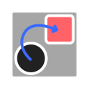

#  Github To Itch (Godot 4.0)
This addon automatically generates a github workflow to publish your game to your itch.io project. Great for use in jams so you can have your playable code live within a couple minutes of pushing to github.

# Setup ⚙️
1. When enabling the addon a window will popup with instructions on how to setup your `BUTLER_API_KEY` so you can actually push to itch.
2. You'll also need to configure your Itch Username and Project Name in the popup window so butler will push to the correct account and project.
3. Create an export preset in `Project > Export` if you don't have one and the addon will add it to your workflow.
4. :tada: You're ready to go, whenever you push to your `main` branch this workflow will publish to itch.io
    To edit the username, or project name go to `Project > Tools > Github to Itch Config` or in your project settings under `github_to_itch/config`

# How it works
- When an export preset has `runnable=true` this will automatically adjust your github workflow to export and upload that to itch.io with the proper channel.
- The workflow uses [Semantic Versioning](https://www.geeksforgeeks.org/introduction-semantic-versioning/) and [Conventional Commits](https://www.conventionalcommits.org/en/v1.0.0/) based on your commit messages to automatically handle version number updates.
- The workflow also creates a release on your github repo, useful for keeping working copies of your exports.

## Customization
The workflow template file is found in `addons/github_to_itch/templates` You can modify that file to change the workflow if needed (maybe you want to change the branch to a `release` branch or something)

## Suggestions :+1:
If you have any ideas or suggestions for the addon please create an issue or fork the project and make a PR!
